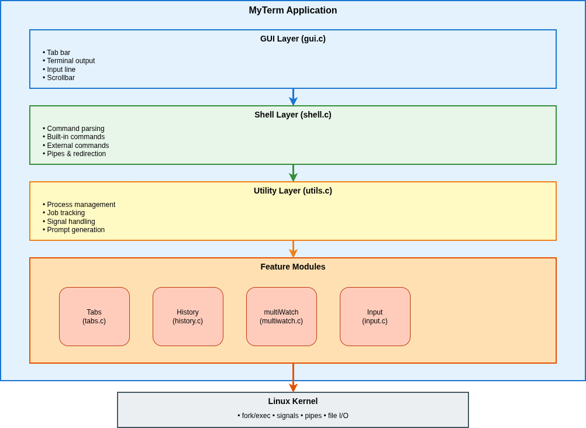
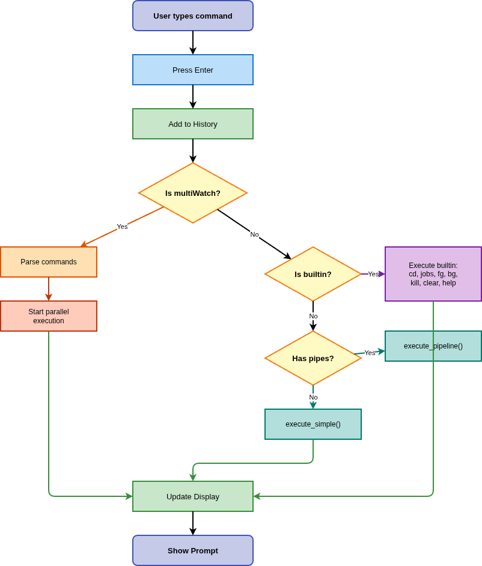

# MyTermw: Custom Terminal Shell Design and Implementation

## Overview:

MyTermw is a custom shell application built from scratch to run in its own graphical window. It's designed to mimic the core features of a traditional Bash terminal, but with its own unique GUI and advanced features.

### Core Architecture: The Building Blocks 

Application stack:

  - Xlib: This provides the lowest level of control for window management and event handling (keyboard, mouse).
  - Cairo + Pango: This is our custom rendering engine. Pango is essential for proper Unicode shaping  (e.g., Devanagari)and maintaining consistent text metrics for accurate cursor placement.
  - POSIX: We use standard system calls like fork/exec to run external programs, pipe/dup2 for I/O redirection, and kill/waitpid for robust job control and process management.

---

##  System Design and Modularity

The project is structured into focused modules for clarity and maintainability.

## Module Breakdown

* `main.c`: Handles application startup, runs the central X11 event loop (listening for user input), and sets up critical signal handlers for cleanup.

* `gui.c`: Contains all the drawing logic for the tab bar, terminal output area, and input line, powered by Cairo/Pango.

* `shell.c`: The core intelligence. It's responsible for parsing commands, executing built-in commands (`cd`, `jobs`), running external programs via `fork/execvp`, and setting up I/O redirection.

* `tabs.c`: Manages the life cycle of independent shell sessions—creating, switching, and destroying tabs.

* `input.c`: Processes all keypresses, manages the input buffer, controls cursor movement (Ctrl+A/E), and handles Tab-autocomplete logic.

* `history.c`: Manages the global history buffer, displaying past commands and running the advanced Ctrl+R searchable history.

* `multiwatch.c`: Implements the logic for the unique `multiWatch` command: running commands in parallel and efficiently multiplexing their I/O for simultaneous display.

* `utils.c`: Contains general helper functions, including buffer management, tracking background jobs, and cleaning up finished processes (SIGCHLD reaping).

# Working 

# Feature Implementations:

- 1. GUI with X11 and Tabs
- 2. External Commands
- 3. Multiline Unicode Input
- 4. Input Redirection <
- 5. Output Redirection > and < >
- 6. Pipes |
- 7. multiWatch
- 8. Ctrl+A / Ctrl+E
- 9. Ctrl+C / Ctrl+Z
- 10. Searchable History
- 11. Tab Autocomplete

**Note:** For detailed technical documentation with code references, see:
- `DESIGN_DOC1.md` through `DESIGN_DOC11.md` (one document per feature) in DOCS folder
- `DESIGN_DOC_12_ADDITIONAL.md` in DOCS folder

## 1. Graphical User Interface (X11 & Multi-Tabs) 

**→ See DESIGN_DOC1.md for complete technical details**

The application opens a window, listens for keyboard and mouse events, and renders the tab bar, output area, and input line. On user input, it updates the input buffer and repaints. When a command produces output, the buffer is appended and the terminal view is repainted.

The entire experience relies on building a GUI from the ground up, using Xlib for window management and Cairo/Pango for high-quality Unicode rendering.

### Implementation Details:

* Window and Events (The Setup): The GUI starts in `main.c` by using Xlib calls: `XOpenDisplay()`, `XCreateSimpleWindow()`, and `XMapWindow()`. The program then enters an event loop (`XNextEvent()`) to capture user actions like key presses and mouse clicks.

* Rendering Unicode (The Display): Instead of the basic `XDrawString()`, we use Cairo for 2D graphics and Pango for text layout in `gui.c`. Pango is crucial because it correctly handles complex Unicode shaping and consistent text metrics, which is vital for displaying international characters correctly.

* Tab Independence (The Shell): Each tab corresponds to an independent shell instance (a separate `Tab` struct). When a new tab is created, the parent shell performs a `fork()`. The child process runs the shell logic.

* I/O Capture: A `pipe()` creates a communication channel. The child's `stdout` and `stderr` are redirected to the *write* end of this pipe using `dup2()`. The parent shell continuously reads the *read* end, capturing the output to update the tab's display buffer.

---

## 2. Run an External Command 

**→ See DESIGN_DOC2.md for complete technical details**

This is the process of safely executing external programs found in the system's path or current directory.

### Implementation Details:

* Command Routing: `shell.c: run_command()` first checks if the input is a built-in command (like `cd` or `jobs`). If not, it assumes an external command.
* External Execution:
    1.  Isolation: `fork()` creates a new child process, ensuring the parent GUI remains responsive.
    2.  Transformation: The child process uses `execvp()` to replace its entire memory space and code with the new program, searching the `$PATH` for the executable.
    3.  Built-ins: Commands like `cd` are handled internally using functions like `chdir()` after resolving `~` to the `$HOME` path.

- Examples: `ls -l`, `gcc -o myprog myprog.c`, `./myprog` (PATH/relative file), bad command prints an error line.

---

## 3. Take Multiline Unicode Input 

**→ See DESIGN_DOC3.md for complete technical details**

To support pasting large code blocks or complex international text, the input handler must be flexible and Unicode-aware.

### Implementation Details:

* Input Handling: The keyboard handler in `main.c` recognizes Shift+Enter and inserts a literal newline character (`\n`) into the input buffer, allowing multiline text entry.
* Locale and Display: We use `setlocale(LC_ALL, "")` to correctly enable `UTF-8` processing to support unicode input/output across multiple languages.
* Safe Execution: When Enter is pressed, `utils.c: run_lines_split_unquoted()` checks the input. If there are multiple lines separated by unquoted newlines (safe to split), it iterates through the split lines, calling `run_command()` for each one sequentially.

- Testing: Paste Unicode sample and execute; use Shift+Enter to insert newlines and confirm echo formatting matches input.

---

## 4. Run an External Command by Redirecting Standard Input from a File ($<$) 

**→ See DESIGN_DOC4.md for complete technical details**

Input redirection allows a program to read from a file instead of the keyboard pipe.

### Implementation Details:

* Parsing: `myterm/shell.c: parse_redirections()` extracts the `< infile.txt` token and the filename from the arguments.
* Redirection: In the child process, before calling `execvp()`:
    1.  The input file is opened using `open(filename, O_RDONLY)`.
    2.  The critical step is calling `dup2(file_fd, STDIN_FILENO)`. This overwrites the standard input file descriptor (0) with the file's descriptor. The executed program will now read from the file.

- Testing:
   - Create `in.txt` with lines; run `cat < in.txt` and `sort < in.txt`; verify outputs.

---

## 5. Run an External Command by Redirecting Standard Output to a File ($>$ and $< >$) 

**→ See DESIGN_DOC5.md for complete technical details**

Output redirection sends program results to a file instead of the GUI display pipe.

### Implementation Details:

* Parsing: `myterm/shell.c` handles both the input file ($<$) and the output file ($>$).
* Output Redirection ($> outfile$):
    1.  The output file is opened/created using `open(filename, O_WRONLY | O_CREAT | O_TRUNC, 0644)` (writable, create, and truncate existing content).
    2.  `dup2(file_fd, STDOUT_FILENO)` overwrites the standard output file descriptor (1). The program's output will now be written to the file.
* Combined Redirection ($< >$): Both input and output `dup2()` operations are performed sequentially in the child process before `execvp()` is called.

- Testing:
   - `echo hi > o.txt` then `cat < o.txt` prints `hi`.
   - `./a.out < in.txt > out.txt` (or `cat < in.txt > out.txt`) produces expected `out.txt`.

---

## 6. Implementing Support for Pipe ($\text{|}$) 

**→ See DESIGN_DOC6.md for complete technical details**

Pipes connect the `stdout` of one process to the `stdin` of the next, facilitating powerful data streams.

### Implementation Details:

* Structure: For $N$ commands in a pipeline, we need $N-1$ communication channels, all created using the `pipe()` system call.
* Wiring the Children: `shell.c: execute_pipeline()` handles the complex forking and wiring:
    * Each child process is `fork()`'d. It uses `dup2()` to redirect its `stdin` from the *read* end of the incoming pipe and its `stdout` to the *write* end of the outgoing pipe.
    * Crucial Step (Deadlock Prevention): All unused pipe ends in both the parent and all children are immediately `close()`'d. This prevents hanging and deadlocks.
    * The last command's `stdout` is captured by the GUI parent process for display.

- Testing:
   - `ls *.c | wc -l` returns count; `cat README.md | sort | head -n 3` shows sorted head.

---

## 7. Implementing a New Command "multiWatch" 

**→ See DESIGN_DOC7.md for complete technical details**

This command creates a live, multiplexed dashboard for several concurrent tasks, requiring non-blocking I/O and cleanup.

### Implementation Details:

* Parallel Execution: For each command in the list, `fork()` is called in `multiwatch.c: start_multiwatch()`.
* I/O via Temp Files: As required, `stdout/stderr` for each child process (PID) is redirected to a unique, hidden temporary file (e.g., `.temp.PIDN.txt`). This is done using `open()` and `dup2()` in the child.
* Multiplexed Monitoring (Parent Shell):
    1.  The parent shell uses the `select()` or `poll()` system call to monitor the file descriptors associated with all these temporary files simultaneously.
    2.  When the function returns, the parent then `read()`s the output from the ready file.
    3.  Output is immediately formatted with the command name and unix timestamp, and printed to the GUI buffer.
* Cleanup (Ctrl+C): Upon receiving Ctrl+C, the system sends `SIGINT` to all child PIDs using `kill()`, and uses `unlink()` to securely delete all temporary files.

- Testing:
   - Run `multiWatch ["ls -l", "sleep 5", "echo hi"]` and observe output.

---

## 8. Line Navigation with Ctrl+A and Ctrl+E 

**→ See DESIGN_DOC8.md for complete technical details**

These shortcuts allow for quick, Bash-like editing of the current input line.

### Implementation Details:

* GUI-Native Handling: Since we are operating within an X11 GUI, we capture the specific KeySym and ControlMask associated with Ctrl+A and Ctrl+E within the `XNextEvent()` loop.
* Cursor Update: The key handler in `myterm/main.c` directly modifies the `Tab.cursor` index:
    * Ctrl+A: Sets `Tab.cursor = 0` (start of the line).
    * Ctrl+E: Sets `Tab.cursor = strlen(Tab.input_line)` (end of the line).
* Redraw: The GUI calls `draw_input()` to repaint the text and position the cursor based on the new index.

---

## 9. Interrupting Commands Running in Your Shell (Signals) 

**→ See DESIGN_DOC9.md for complete technical details**

Implementing job control allows users to manage running programs without stopping the shell itself.

### Implementation Details:

* Interrupt (Ctrl+C): The system sends the `SIGINT` signal to the entire foreground process group via `kill(-current_fg_pgid, SIGINT)`. The parent shell remains active.
* Background (Ctrl+Z): This sends the `SIGTSTP` signal (stop signal) using `kill()`, pausing the job. The job is then recorded in `Tab.procs` as a stopped background job.
* Reaping (Zombie Prevention): `myterm/main.c: reaper()` is the `SIGCHLD` signal handler. It uses `waitpid(-1, WNOHANG)` repeatedly to clean up finished child processes, preventing zombie processes.

- Testing:
   - Run `sleep 10` and press Ctrl+C to stop.
   - Run `sleep 10` and press Ctrl+Z to background; then run `jobs` to see the job.

---

## 10. Implementing a Searchable Shell History

**→ See DESIGN_DOC10.md for complete technical details**

A shared, searchable history is implemented for command recall and convenience.

### Implementation Details:

* Global Storage: All executed commands are added to a global 10,000-entry ring buffer (`g_history[]`) managed by `history.c`. The history is shared across all tabs.
* Display: The built-in `history` command prints the most recent 1,000 entries.
* Search (Ctrl+R Logic):
    1.  Exact Match: The primary search looks for the most recent command that exactly matches the search term.
    2.  Longest Common Substring (LCS): If no exact match is found, the system calculates the LCS between the search term and history entries. It returns the command(s) for which the LCS length is maximal and is greater than 2 characters.
    3.  No Match: If neither criteria is met, it prints the "No match..." message.

- Testing:
   - Execute multiple commands; run `history` to show recent up to 1,000.
   - Use Ctrl+R with an exact term (shows exact match) and with a near term (shows longest-substring matches > 2), else shows no match.

---

## 11. Implementing Auto-Complete Feature for File Names (Tab) 

**→ See DESIGN_DOC11.md for complete technical details**

This feature minimizes typing by anticipating file names in the current working directory.

### Implementation Details:

* Directory Scan: `myterm/input.c: autocomplete()` isolates the last argument token (the prefix). It then uses the `opendir()` and `readdir()` system calls to list files in the current directory.
* Completion Logic:
    * Single Match: The full filename replaces the prefix in the input buffer.
    * Multiple Matches (LCP): If multiple files match, the shell first calculates the Longest Common Prefix (LCP) and completes the input up to this LCP.
    * Ambiguity: If, after LCP completion, ambiguity remains, the shell prints a numbered menu (e.g., "1. fileA 2. fileB") and waits for the user's numeric selection to finalize the path.
*   This feature only searches the current directory.

# MyTermw: Enhanced Features and Project Constraints

This section focuses on the extra functionality added to improve the shell's usability and details the current limits of the project.

---

##  Additional Features (Beyond Core Requirements)

**→ See DESIGN_DOC_ADDITIONAL.md for complete technical details**

These features were added to make MyTermw feel more polished and complete.

* Global Command History: All open tabs share a single history buffer (10,000 entries). You can use Ctrl+R to search for commands run in any tab.
    * Implementation: A central ring buffer in `myterm/history.c` stores all commands, shared across the entire application.
* Clipboard Copy/Paste (Ctrl+Shift+C / Ctrl+Shift+V): Allows standard terminal copy/paste to work with other desktop applications.
    * Implementation: `myterm/main.c` handles complex X11 messaging and uses standard identifiers (atoms) to exchange text data.
* Mouse Support (Tab/Scroll): You can use the mouse to click tabs to switch/close them and drag the scrollbar to navigate output.
    * Implementation: Mouse clicks and movement are captured in `myterm/main.c` and processed by `handle_tab_click()` and specific X11 events for scrolling.
* Quick Scrolling Keys (PageUp/PageDown, Home/End): Enables fast movement through the output buffer using these keyboard shortcuts.
    * Implementation: Key handlers in `myterm/main.c` directly adjust the `Tab.scroll` index.
* Tilde Expansion in $\mathbf{cd}$: The shell understands `~` so `cd ~/path` correctly expands to your home directory.
    * Implementation: The `cd` built-in in `myterm/shell.c` checks for `~` and replaces it with `getenv("HOME")`.
* Graceful Job Tracking: Ensures finished background jobs are cleanly removed from the OS and the shell's job list (preventing zombies).
    * Implementation: A signal handler (`myterm/main.c: reaper()`) runs when a child finishes, using `waitpid(-1, WNOHANG)` to clean up the process entry.
* Unicode Rendering with Pango: Guarantees that complex international scripts and symbols are measured and drawn correctly.
    * Implementation: `myterm/gui.c` uses the Pango library for advanced text layout.
* Basic Selection and Window Title: Sets up the window title and registers essential X11 text identifiers for basic copy/paste compatibility.
    * Implementation: `myterm/main.c` uses `XStoreName()` for the title and sets up X11 text identifiers (atoms).

---

## Project Constraints and Limitations

* History Persistence: History is not saved to a file yet. It is lost when the application closes.
* I/O Redirection: Redirection is basic. It does not support append (`>>`), stderr-only (`2>`), or merging streams (`2>&1`).
* Input Spacing: Redirection requires spaces (e.g., you must use `cmd > outfile`, not `cmd>outfile`).
* Execution Environment: It must run in a graphical environment (X server). It won't work in a pure text-only console.
* Shell Expansions: The shell does not do glob expansion (`*.c`) or variable expansion (`$VAR`).
