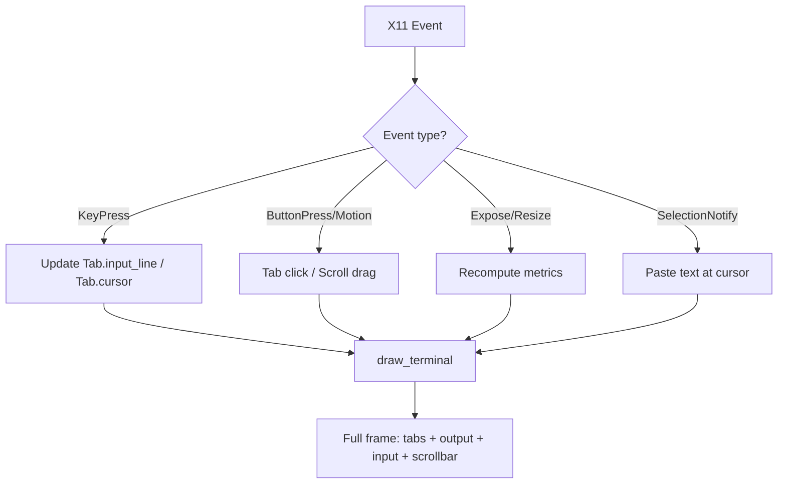
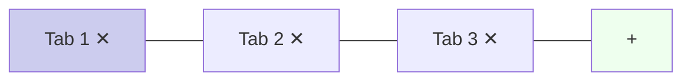
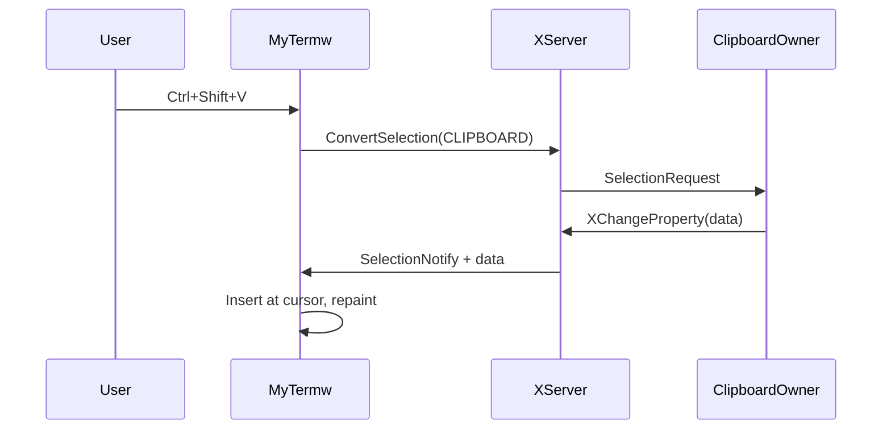

# DESIGN_DOC1: Graphical User Interface

## Quick Index
1. What this feature provides
2. Boot sequence (window → first paint)
3. Render loop (event → state → repaint)
4. Typing and caret positioning
5. Scrolling (math and mouse dragging)
6. Tabs (creation, switching, closing)
7. Clipboard (Ctrl+Shift+V paste)
8. Examples to try
9. Limits and future work

## 1) What this feature provides
- Custom GUI window with X11 (no terminal emulator dependency).
- Multiple independent tabs, each with its own output buffer and input line.
- Unicode-correct text rendering with Pango for complex scripts.
- Mouse support: click tabs, drag scrollbar, mouse wheel scrolling.
- Clipboard paste integration with other desktop apps.
- Responsive UI: repaints while commands run, handles Ctrl+C/Z immediately.

### File/Function Access Map

```mermaid
graph TD
    A[GUI Feature] --> B[myterm/main.c]
    A --> C[myterm/gui.c]
    A --> D[myterm/tabs.c]
    A --> E[myterm/input.c]
    A --> F[myterm/utils.c]
    
    B --> B1[main: XOpenDisplay, XCreateWindow]
    B --> B2[event loop: XNextEvent]
    B --> B3[key handler: KeyPress events]
    B --> B4[clipboard: SelectionNotify]
    
    C --> C1[draw_terminal: full repaint]
    C --> C2[draw_tabs: tab bar rendering]
    C --> C3[draw_input: Pango layout]
    C --> C4[draw_scrollbar: knob + track]
    
    D --> D1[create_new_tab: allocate Tab]
    D --> D2[close_tab: cleanup]
    D --> D3[switch_to_tab: change active]
    
    E --> E1[handle_tab_click: mouse hits]
    E --> E2[handle_motion_drag: scrollbar]
    
    F --> F1[append_line: buffer management]
    F --> F2[run_lines_split_unquoted: multiline]
```


## 2) Boot sequence (window → first paint)
1. **X11 window creation**: `myterm/main.c` opens the display, creates a window, registers event masks (KeyPress, ButtonPress, MotionNotify, Expose, clipboard events), and maps the window.
2. **Cairo/Pango initialization**: Font is measured to set `LINE_HEIGHT` and `LINE_GAP` for consistent text metrics.
3. **First tab creation**: `myterm/tabs.c: create_new_tab()` allocates a `Tab` struct with empty output buffer, empty input line, cursor at 0.
4. **First paint**: `myterm/gui.c: draw_terminal()` renders the tab bar, output area (empty), and input prompt.

References:
- `myterm/main.c` lines 10–50 (window setup and event loop).
- `myterm/gui.c` lines 5–20 (Cairo/Pango initialization).
- `myterm/tabs.c: create_new_tab()` lines 5–25.
- `myterm/gui.c: draw_terminal()` lines 30–150.

## 3) Render loop (event → state → repaint)
Every change triggers a full repaint via `draw_terminal()`. No partial updates—this keeps the UI consistent.

**Repaint steps:**
1. Clear background.
2. Draw tab bar (active tab highlighted, close boxes, `+` button).
3. Draw status banners if jobs/multiWatch active.
4. Compute visible lines: `(output_area_height) / (LINE_HEIGHT + LINE_GAP)`.
5. Draw visible slice of `Tab.buffer` (respecting `Tab.scroll`).
6. Draw divider and input line at bottom.
7. Draw scrollbar (knob size proportional to visible/total lines).

**Why it's stable:** All positions computed from measured text and constants. No cached pixel values that can drift.

### Render Loop Diagram


References:
- `myterm/gui.c: draw_terminal()` lines 30–150.
- `myterm/gui.c: draw_tabs()` lines 160–180.
- `myterm/gui.c: draw_scrollbar()` lines 250–280.

## 4) Typing and caret positioning
- **Key handling**: `myterm/main.c` updates `Tab.input_line` and `Tab.cursor` on each keypress, then calls `draw_terminal()`.
- **Caret accuracy**: `myterm/gui.c: draw_input()` renders prompt + input as a single Pango layout. Caret position is derived from `pango_layout_index_to_pos(len(prefix) + cursor)`, ensuring pixel-perfect alignment even with Unicode (e.g., Devanagari, emoji).
- **Multiline support**: Shift+Enter inserts `\n`; Pango handles layout naturally.

**Example:** Input `echo नमस्ते` with cursor at end. Pango shapes Devanagari correctly and positions caret at the visual end, not at a guessed byte offset.

References:
- `myterm/main.c` lines 74–120 (key handling).
- `myterm/gui.c: draw_input()` lines 180–220 (Pango layout and caret).

**Command submission (Enter):**
- If input has unquoted newlines, split and run each line via `myterm/utils.c: run_lines_split_unquoted()`.
- Otherwise, run as single command via `myterm/shell.c: run_command()`.
- During foreground execution, parent reads child output in non-blocking mode and pumps X events between reads. This keeps the UI responsive—repaints happen, mouse works, Ctrl+C/Z are handled immediately.

References:
- `myterm/main.c` lines 130–140 (Enter detection).
- `myterm/utils.c: run_lines_split_unquoted()` lines 42–58.
- `myterm/shell.c: execute_simple()` lines 44–76 (event pumping).

## 5) Scrolling (math and mouse dragging)
**Scroll model:** View is a window into `Tab.buffer`. `Tab.scroll` indicates how many lines up from the bottom.

**Math:**
- `L` = total lines, `V` = visible lines.
- Max scroll = `L - V`.
- Knob height = `(track_h * V) / L` (clamped to minimum for grab-ability).
- Knob position = linear mapping of `scroll` to track.

**Example:** 300 lines, 20 visible, track 400px high.
- Max scroll = 280.
- Knob height = `(400 * 20) / 300 ≈ 26px`.
- Dragging knob to midpoint → scroll ≈ 140 (halfway into history).

**Mouse wheel:** Button4 (up) increases scroll, Button5 (down) decreases scroll.

References:
- `myterm/gui.c: draw_scrollbar()` lines 250–280.
- `myterm/input.c: handle_motion_drag()` lines 55–68.

### Scroll Mapping
```mermaid
flowchart LR
  A[Buffer L lines] --> B[Visible V lines]
  B --> C[Max scroll = L - V]
  C --> D[Knob height = track_h * V / L]
  C --> E[Knob y maps scroll linearly]
  E --> F[View = buffer[L - V - scroll : L - scroll]]
```

## 6) Tabs (creation, switching, closing)
**Tab clicks** handled by `myterm/input.c: handle_tab_click()`:
- Click tab body → switch to that tab.
- Click close box → close tab (or clear if last tab).
- Click `+` area → create new tab.

**Tab independence:** Each tab has its own:
- Output buffer (`Tab.buffer`).
- Input line and cursor.
- Job list (`Tab.procs[]`).
- MultiWatch state.

Switching tabs just changes which `Tab` struct is active—instant, no data copying.

References:
- `myterm/input.c: handle_tab_click()` lines 3–53.
- `myterm/tabs.c: create_new_tab()` lines 5–25.
- `myterm/tabs.c: close_tab()` lines 30–50.
- `myterm/tabs.c: switch_to_tab()` lines 55–65.

### Tab Bar Layout


## 7) Clipboard (Ctrl+Shift+V paste)
**Paste flow:**
1. User presses Ctrl+Shift+V.
2. `myterm/main.c` calls `XConvertSelection(CLIPBOARD, UTF8_STRING)`.
3. X server sends `SelectionNotify` event with clipboard data.
4. Data is inserted at `Tab.cursor` position.
5. `draw_terminal()` repaints.

**X11 protocol:**


References:
- `myterm/main.c` lines 90–91 (Ctrl+Shift+V handling)
- `myterm/main.c` lines 48–66 (SelectionNotify event).

**Resize handling:**
- `Expose` event triggers full repaint.
- Metrics recomputed: visible lines, input area height, scrollbar dimensions.
- No cached pixel values → no layout tears or jitter.

References:
- `myterm/main.c` lines 45–47 (Expose event).
- `myterm/gui.c: draw_terminal()` lines 50–80 (status banners).

## 8) Examples to try
- Create/switch/close tabs: click tab bodies, close boxes, `+` button.
- Type Unicode: `echo नमस्ते world` → caret stays aligned with glyphs.
- Multiline input: Shift+Enter to insert newlines, verify caret and layout.
- Scroll: `seq 1 200` → drag scrollbar, use mouse wheel, PageUp/PageDown.
- Paste: copy text from browser, Ctrl+Shift+V into MyTermw.
- Responsive UI: run `sleep 10`, press Ctrl+C → window stays interactive.

## 9) Limits and future work
**Current limits:**
- Output buffer capped at `MAX_LINES` (oldest lines dropped on overflow).
- Input length capped at `MAX_LINE_LEN`.
- Not a TTY emulator: ncurses apps may not work correctly.
- No IME composition support.

**Future work:**
- Pseudo-terminal (PTY) for full TTY emulation.
- Configurable font size and DPI scaling.
- Persistent tab state across restarts.
- IME support for complex input methods.
