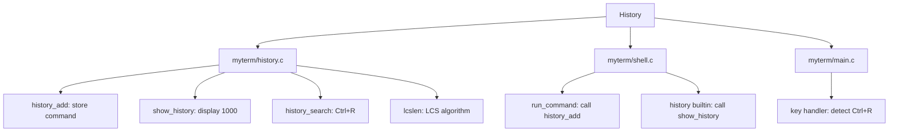

# DESIGN_DOC10: Searchable History (global across tabs)

## Quick Index
1. What this feature provides
2. Storage (global ring buffer)
3. Adding commands (history_add)
4. Viewing history (history builtin)
5. Search algorithm (Ctrl+R: exact + LCS fallback)
6. Examples to try
7. Limits and future work

## 1) What this feature provides
- Shared command history across all tabs (10,000 entries).
- `history` builtin to view recent commands (up to 1,000).
- Ctrl+R to search: exact match first, then longest common substring (LCS) fallback.

### File/Function Access Map

## 2) Storage (global ring buffer)
Handler: `myterm/history.c`.

- Global array `g_history[HISTORY_MAX]` (10,000 entries).
- Ring buffer with `g_hist_head` and `g_hist_count`.
- Avoids immediate duplicates: if the last entry matches the new command, it is not added again.

References:
- `myterm/history.c` lines 4–6.

## 3) Adding commands (history_add)
Handler: `myterm/history.c: history_add()`.

- Called from `myterm/shell.c: run_command()` after echoing the command.
- Checks if the last entry is identical; if so, skips.
- Otherwise, duplicates the command string and stores it in the ring buffer.
- Advances `g_hist_head` and increments `g_hist_count` (capped at `HISTORY_MAX`).

References:
- `myterm/history.c: history_add()` lines 8–20.
- `myterm/shell.c: run_command()` line 241 (call to history_add).

## 4) Viewing history (history builtin)
Handler: `myterm/history.c: show_history()`.

- Prints the most recent `HISTORY_SHOW` (1,000) entries in reverse chronological order (newest last).
- Each entry is numbered starting from 1 (oldest shown) to N (newest shown).
- Example: "   1  cd", "   2  ls", "   3  ls -l", "   4  pwd", "   5  history".
- Iterates backward from `g_hist_head - 1`.
- Format: `%4d  %s` (4-digit number, 2 spaces, command).

References:
- `myterm/history.c: show_history()` lines 22–33.
- `myterm/shell.c: run_command()` lines 290–295 (history builtin handler).

## 5) Search algorithm (Ctrl+R: exact + LCS fallback)
Handler: `myterm/history.c: history_search()`.

- Phase 1 (exact match): scan history in reverse order; if an entry exactly matches the search term, print it and return.
- Phase 2 (LCS fallback): compute the longest common substring (LCS) between the search term and each history entry using `lcslen()`.
- If the best LCS length is > 2, print all entries with that LCS length.
- If no match or LCS ≤ 2, print "No match for search term in history".

### LCS Algorithm
- `lcslen(a, b)` finds the longest contiguous substring common to both strings.
- Nested loops over all start positions in `a` and `b`; extend while characters match.

References:
- `myterm/history.c: history_search()` lines 46–66.
- `myterm/history.c: lcslen()` lines 35–44.
- `myterm/main.c` lines 150–160 (Ctrl+R key detection and search mode activation).

## 6) Examples to try
- Execute several commands: `ls`, `pwd`, `echo hello`, `cat file.txt`.
- Run `history` → see recent commands.
- Press Ctrl+R, type `echo` → exact match returns `echo hello`.
- Press Ctrl+R, type `ech` → LCS fallback returns `echo hello` if LCS > 2.
- Press Ctrl+R, type `xyz` → "No match for search term in history".

## 7) Limits and future work
- No persistence: history is lost on exit.
- No fuzzy matching beyond LCS.
- Future: save to `~/.myterm_history` on exit; load on start; add fuzzy search options.
