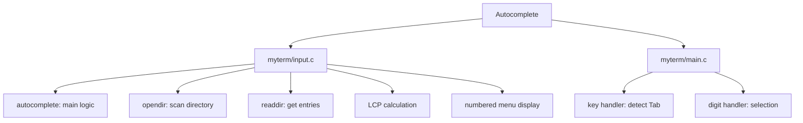

# DESIGN_DOC11: File Name Auto-complete (Tab)

## Quick Index
1. What this feature provides
2. Token extraction and prefix
3. Directory scan and filtering
4. Completion logic (single, LCP, menu)
5. Numeric selection
6. Examples to try
7. Limits and future work

## 1) What this feature provides
- Reduces typing by completing file names in the current directory.
- Press Tab to trigger completion.
- Single match: inserts full name.
- Multiple matches: extends to longest common prefix (LCP); if still ambiguous, shows numbered menu.

### File/Function Access Map


## 2) Token extraction and prefix
Handler: `myterm/input.c: autocomplete()`.

- Scans backward from the cursor to find the last token (delimited by space or tab).
- Extracts the prefix (the partial filename typed so far).

References:
- `myterm/input.c: autocomplete()` lines 70–72 (token extraction logic).
- `myterm/main.c` line 103 (Tab key detection and call to autocomplete).

## 3) Directory scan and filtering
- Opens current directory with `opendir(".")`.
- Reads entries with `readdir()`.
- Filters entries:
  - Hidden files (starting with `.`) are only included if the prefix starts with `.`.
  - Entries must match the prefix (via `strncmp`).
- Collects up to 256 matching names.

References:
- `myterm/input.c: autocomplete()` lines 73–87 (directory scan and filtering loop).

## 4) Completion logic (single, LCP, menu)
- **Single match**: replace the token with the full filename; set cursor to end.
- **Multiple matches**:
  - Compute the longest common prefix (LCP) across all matches.
  - If LCP is longer than the current prefix, extend the input to the LCP.
  - If ambiguity remains (LCP = prefix length), print a numbered list of candidates and store them in `Tab.ac_choices[]`.

References:
- `myterm/input.c: autocomplete()` lines 89–131 (single match completion with space/slash, LCP calculation, and menu display).

## 5) Numeric selection
- After a numbered menu is shown, the user can press a digit (1–9) to select a candidate.
- The key handler in `myterm/main.c` detects the digit, replaces the token with the chosen filename, and clears the menu.

References:
- `myterm/main.c` line 110 (numeric selection handler).

## 6) Examples to try
- Directory with `abc.txt`, `abcd.txt`, `def.txt`.
- Type `cat ab` + Tab → extends to `cat abc` (LCP).
- Type `cat abc` + Tab → shows menu:
  ```
  Choices:
  1. abc.txt
  2. abcd.txt
  Type number (1-9) to choose.
  ```
- Press `1` → input becomes `cat abc.txt`.

## 7) Limits and future work
- Only current directory; no nested path completion.
- No glob expansion (`*.txt`).
- Candidates capped at 256.
- Future: add nested path traversal; support glob patterns; increase candidate limit.
