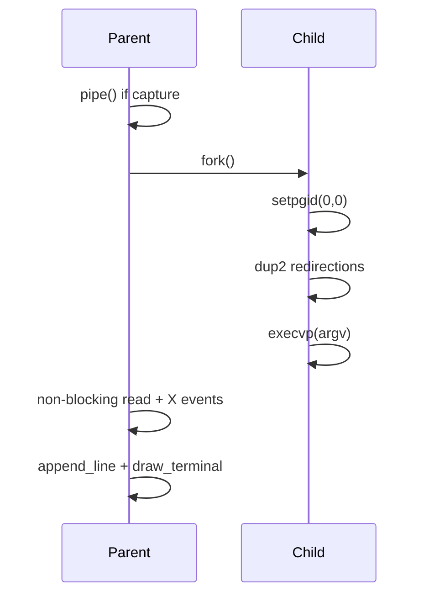
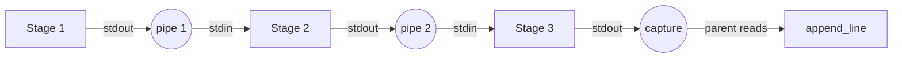

# DESIGN_DOC2: Running Commands

## Quick Index
1. What this feature provides
2. Command routing (Enter → execution path)
3. Builtins (cd, pwd, jobs, etc.)
4. Simple external commands
5. Pipelines (N stages with PGID)
6. Complex lines via /bin/sh -c
7. Signals and job control
8. Examples to try
9. Limits and future work

## 1) What this feature provides
- Execute external programs (e.g., `ls`, `gcc`, custom binaries).
- Built-in commands (cd, pwd, jobs, kill, bg, fg, history, clear, exit, help).
- Pipelines: connect stdout of one command to stdin of the next (`cmd1 | cmd2 | cmd3`).
- Background jobs (`cmd &`).
- Input/output redirection (`< infile`, `> outfile`).
- Job control: Ctrl+C (interrupt), Ctrl+Z (stop and background).
- Responsive UI: GUI stays interactive while foreground jobs run.

### File/Function Access Map
```mermaid
graph TD
    A[Running Commands] --> B[myterm/shell.c]
    A --> C[myterm/utils.c]
    A --> D[myterm/history.c]
    A --> E[myterm/multiwatch.c]
    
    B --> B1[run_command: routing logic]
    B --> B2[execute_simple: fork + execvp]
    B --> B3[execute_pipeline: N-stage pipes]
    B --> B4[execute_sh: /bin/sh -c]
    B --> B5[parse_redirections: < >]
    B --> B6[split_pipeline: tokenize by |]
    
    C --> C1[list_jobs: show background]
    C --> C2[remove_proc: cleanup]
    C --> C3[reaper: SIGCHLD handler]
    C --> C4[run_lines_split_unquoted: multiline]
    
    D --> D1[history_add: store command]
    D --> D2[show_history: display 1000]
    
    E --> E1[parse_multiwatch: extract cmds]
    E --> E2[start_multiwatch: parallel exec]
```

## 2) Command routing (Enter → execution path)
Entry point: `myterm/shell.c: run_command()`.

**Routing logic** (checked in order):
1. **multiWatch** → parse command list, start multiWatch.
2. **Trailing `&`** → strip `&`, run via pipeline path with `background=1`.
3. **Complex syntax** (contains `"'|<>;\n\t`) → delegate to `/bin/sh -c` via `execute_sh()`.
4. **Otherwise** → tokenize into `argv[]`:
   - Check if builtin → run in-process.
   - Check if contains `|` → run pipeline via `execute_pipeline()`.
   - Else → run simple external via `execute_simple()`.

### Routing Diagram
```mermaid
flowchart TD
  A[Enter pressed] --> B[Echo to output + history_add]
  B --> C{multiWatch?}
  C -- Yes --> MW[start_multiwatch]
  C -- No --> D{Ends with &?}
  D -- Yes --> BG[execute_pipeline bg=1]
  D -- No --> E{Complex syntax?}
  E -- Yes --> SH[execute_sh /bin/sh -c]
  E -- No --> T[tokenize argv]
  T --> G{builtin?}
  G -- Yes --> BLT[run builtin in-process]
  G -- No --> P{Contains | ?}
  P -- Yes --> PL[execute_pipeline bg=0]
  P -- No --> EX[execute_simple bg=0]
```

References:
- `myterm/shell.c: run_command()` lines 237–394.
- `myterm/multiwatch.c: parse_multiwatch()` lines 12–40.
- `myterm/multiwatch.c: start_multiwatch()` lines 87–118.

## 3) Builtins (cd, pwd, jobs, etc.)
Builtins run in-process (no fork), keeping the GUI responsive.

**Implemented builtins:**
- `cd [dir]`: change working directory. `~` expands to `$HOME`.
- `pwd`: print current directory.
- `jobs`: list tracked background processes for current tab.
- `kill <pid>`: send SIGTERM; remove from job list on success.
- `bg <pid>`: continue stopped job in background.
- `fg <pid>`: bring job to foreground and wait (with event pumping).
- `history`: show recent commands (up to 1,000).
- `clear`: clear output buffer.
- `exit`: close current tab (or exit if last tab).
- `help`: show available commands.

References:
- `myterm/shell.c: run_command()` lines 264–301 (builtin handling).
- `myterm/utils.c: list_jobs()` lines 64–68.
- `myterm/history.c: show_history()` lines 22–28.

## 4) Simple external commands
Handler: `myterm/shell.c: execute_simple()`.

**Execution flow:**
1. **Parse redirections**: `parse_redirections()` extracts `< infile` and `> outfile` tokens, removes them from `argv[]`.
2. **Create capture pipe** (if foreground without `>`): parent will read child's stdout/stderr.
3. **Fork child process**.
4. **Child setup**:
   - `setpgid(0,0)` → become own process group leader.
   - Apply redirections: `dup2(infd, STDIN_FILENO)`, `dup2(outfd, STDOUT_FILENO/STDERR_FILENO)`.
   - Close all pipe FDs.
   - `execvp(argv[0], argv)` → replace process with new program.
5. **Parent**:
   - **Foreground with capture**: non-blocking read loop, pump X events between reads, append output to `Tab.buffer`, handle Ctrl+C/Z.
   - **Background or with `>`**: track job in `Tab.procs[]`, return immediately.

### Simple Exec Diagram


References:
- `myterm/shell.c: execute_simple()` lines 27–109.
- `myterm/shell.c: parse_redirections()` lines 9–25.

## 5) Pipelines (N stages with PGID)
Handler: `myterm/shell.c: execute_pipeline()`.

**Pipeline setup:**
1. **Split by `|`**: `split_pipeline()` divides command line into stages.
2. **Create N−1 pipes** for N stages.
3. **Fork each stage**:
   - Child: `setpgid(0, pgid)` → join same process group.
   - Wire stdin/stdout with `dup2()` to correct pipe ends.
   - Close all unused pipe FDs (critical for EOF propagation).
   - `execvp(argv)`.
4. **Parent**:
   - Close all pipe FDs after forking all children.
   - **Foreground**: last stage's output captured via capture pipe; non-blocking read + X event pumping.
   - **Background**: track PGID in `Tab.procs[]`.

**Process group (PGID):** All children join the same PGID. Signals (Ctrl+C/Z) are sent to `-pgid` to affect the entire pipeline.

### Pipeline Wiring


References:
- `myterm/shell.c: split_pipeline()` lines 111–113.
- `myterm/shell.c: execute_pipeline()` lines 141–230.

## 6) Complex lines via /bin/sh -c
Handler: `myterm/shell.c: execute_sh()`.

Delegates to system shell for:
- Quoting and escaping.
- Glob expansion (`*.c`).
- Variable expansion (`$VAR`).
- Complex redirection (`2>&1`, `>>`).

**Implementation:** Runs `/bin/sh -c "line"` with same non-blocking capture loop as `execute_simple()`.

References:
- `myterm/shell.c: execute_sh()` lines 115–139.

## 7) Signals and job control
**Foreground PGID:** Saved in `current_fg_pgid` during foreground execution.

**Ctrl+C (SIGINT):**
- Detected in X event loop.
- `kill(-current_fg_pgid, SIGINT)` → interrupt entire process group.
- Parent continues reading until EOF or child exit.

**Ctrl+Z (SIGTSTP):**
- `kill(-current_fg_pgid, SIGTSTP)` → stop process group.
- Job recorded in `Tab.procs[]`.
- `kill(-current_fg_pgid, SIGCONT)` → resume in background.
- Message: `[moved to background]`.

**Zombie prevention:**
- `SIGCHLD` handler (`myterm/utils.c: reaper()`) installed at startup.
- Calls `waitpid(-1, &status, WNOHANG)` in loop to reap finished children.
- Removes reaped PIDs from all tabs' job lists.

References:
- `myterm/shell.c: execute_simple()` lines 54–67 (Ctrl+C/Z in read loop).
- `myterm/shell.c: execute_pipeline()` lines 203–216 (Ctrl+C/Z in pipeline).
- `myterm/utils.c: reaper()` lines 70–72.
- `myterm/main.c` line 6 (signal handler installation).

**Why UI stays responsive:**
- Non-blocking reads from child pipes.
- X events pumped between reads.
- Repaints happen immediately.
- Ctrl+C/Z handled in event loop without blocking.

## 8) Examples to try
- **Simple commands**: `pwd`, `ls -l`, `gcc -o prog prog.c`.
- **Invalid command**: `badcmd` → prints error.
- **Redirection**: `echo hi > o.txt` then `cat < o.txt`.
- **Pipeline**: `cat README.md | sort | head -n 3`.
- **Background**: `sleep 5 &` then `jobs`, then `kill <pid>`.
- **Job control**: `sleep 10` then Ctrl+Z → `jobs` → `bg <pid>` or `fg <pid>`.
- **Complex**: `echo "hello world" | tr a-z A-Z` → uppercase conversion.

## 9) Limits and future work
**Current limits:**
- No append mode (`>>`).
- No separate stderr redirection (`2>`, `2>&1`).
- Redirection requires spaces: `cmd > file` (not `cmd>file`).
- No glob expansion (`*.c`) or variable expansion (`$VAR`) in simple path (delegated to `/bin/sh -c`).
- No PTY: ncurses apps may not work correctly.

**Future work:**
- Implement `>>`, `2>`, `2>&1` syntax.
- Add glob and variable expansion to simple path.
- Pseudo-terminal (PTY) for full TTY emulation.
- Per-stage stderr capture in pipelines.
