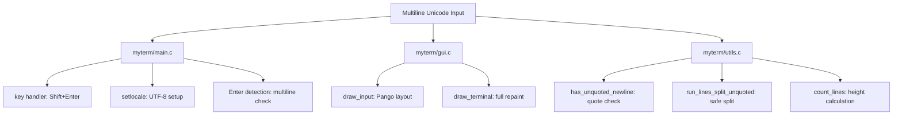

# DESIGN_DOC3: Multiline Unicode Input

## Quick Index
1. What this feature provides
2. Lifecycle: keypress/paste → buffer → repaint
3. Unicode correctness (locale + shaping)
4. Multiline entry (Shift+Enter)
5. Safe execution of multi-line input (unquoted split)
6. Caret accuracy with multi-line Unicode
7. Examples to try
8. Limits and edge cases
9. Future work

## 1) What this feature provides
- Multiline input in the bottom input box (not just single-line).
- Correct handling of Unicode text for both display and caret positioning.
- Safe execution of multi-line input by splitting only on unquoted newlines.

### File/Function Access Map


## 2) Lifecycle: keypress/paste → buffer → repaint
- Keypress/paste handled in `myterm/main.c`.
- `Tab.input_line` is edited (insert char, delete, insert `\n` on Shift+Enter).
- `Tab.cursor` is updated accordingly.
- `myterm/gui.c: draw_terminal()` is called to repaint the frame (tabs, output, input).

### Flow Diagram
```mermaid
flowchart TD
  A[Key press / Paste] --> B[Edit Tab.input_line / Tab.cursor]
  B --> C[draw_terminal()]
  C --> D[draw_input(): prompt + input via Pango]
  D --> E[Caret positioned from Pango caret rect]
```

Relevant code:
- `myterm/main.c` lines 100–110 (Shift+Enter insertion at key handler).
- `myterm/main.c` lines 130–140 (Enter path decides split-vs-single run).
- `myterm/gui.c: draw_input()` lines 180–220.
- `myterm/gui.c: draw_terminal()` lines 30–150.
- `myterm/utils.c: count_lines()` lines 25–29.

## 3) Unicode correctness (locale + shaping)
- Locale setup in `myterm/main.c`: `setlocale(LC_ALL, "")`; warnings if `XSupportsLocale()` is missing.
- Rendering via Pango/Cairo (`myterm/gui.c`) ensures complex scripts (e.g., Devanagari) are shaped correctly.
- Caret position uses `pango_layout_index_to_pos()` on the combined string `"user@MyTermw> " + input` to align the caret with actual glyphs.

References:
- `myterm/main.c` lines 5–8 (locale setup).
- `myterm/gui.c: draw_input()` lines 180–220 (Pango layout and caret calculation).

## 4) Multiline entry (Shift+Enter)
- Holding Shift and pressing Enter inserts a literal newline `\n` into `Tab.input_line` (see `myterm/main.c` key handler).
- The input area height adapts: `myterm/gui.c` computes `input_lines = count_lines(t->input_line)` and reserves space accordingly.
- The caret math remains correct because it is derived from the same Pango layout used for drawing.

## 5) Safe execution of multi-line input (unquoted split)
- If the input contains an unquoted newline, `myterm/utils.c: has_unquoted_newline()` returns true.
- `myterm/utils.c: run_lines_split_unquoted()` performs the split while respecting quotes and escapes:
  - Tracks state flags for single quotes, double quotes, and backslash escapes.
  - Only treats a newline as a splitter when not inside quotes.
  - Trims each segment and calls `run_command(segment, t)` for non-empty parts.

### Split Logic Diagram
```mermaid
flowchart LR
  S[Input string] --> ST{Inside quotes?}
  ST -- Yes --> K[Ignore newline]
  ST -- No --> N{See newline?}
  N -- Yes --> SEG[Emit segment (trimmed) → run_command]
  N -- No --> ADV[Advance]
  K --> ADV
  ADV --> ST
```

References:
- `myterm/utils.c: has_unquoted_newline()` lines 31–39.
- `myterm/utils.c: run_lines_split_unquoted()` lines 42–58.

## 6) Caret accuracy with multi-line Unicode
- `myterm/gui.c: draw_input()` builds a single Pango layout from prompt + input.
- The caret index is computed as `len(prefix) + cursor` using the byte cursor stored in `Tab.cursor`.
- Pango maps this index to an on-screen rectangle; the caret line is drawn at that exact x/y, keeping it visually aligned even with multi-line and complex glyphs.

## 7) Examples to try
- Shift+Enter to build:
  ```
  echo नमस्ते
  echo world
  ```
  Press Enter: both lines run, order preserved.

- Quoted newline (no split inside quotes):
  ```
  echo "hello\nworld"
  ```
  Runs as one command; no unsafe splitting.

- Paste a paragraph with Unicode and verify caret alignment and wrapping.

## 8) Limits and edge cases
- Input length limited by `MAX_LINE_LEN` (`myterm/myterm.h`).
- Cursor operations clamp to `[0, strlen(input_line)]`.
- No IME-specific handling; relies on standard X key events.
- Very long multi-line input increases reserved input area; output area shrinks proportionally.

## 9) Future work
- Bracketed paste mode to distinguish paste from typing and avoid accidental execution.
- IME composition support for complex input methods.
- Persistent input history across restarts.
