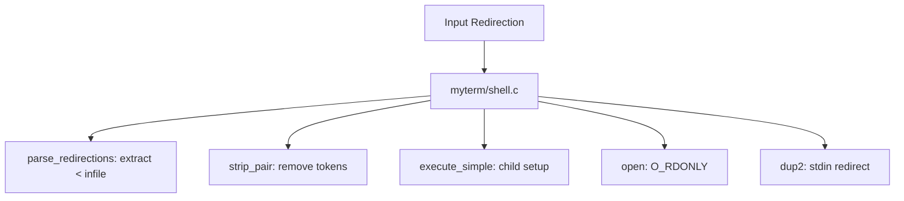
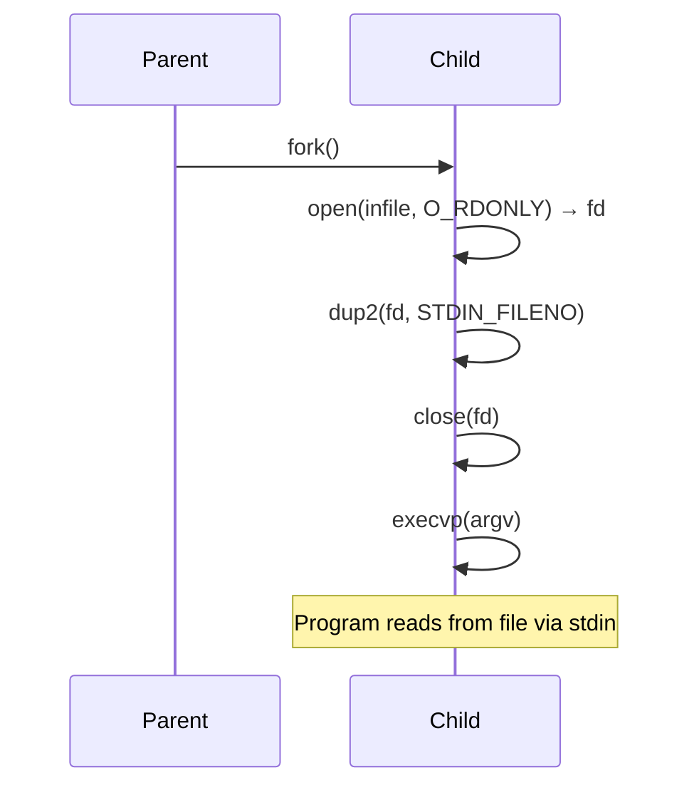

# DESIGN_DOC4: Input Redirection (< infile)

## Quick Index
1. What this feature provides
2. Parsing and token removal
3. Child setup (open + dup2)
4. Error handling
5. Examples to try
6. Limits and future work

## 1) What this feature provides
- Redirects a program's stdin from a file instead of the terminal.
- Syntax: `cmd < infile.txt`.

### File/Function Access Map

## 2) Parsing and token removal
Handler: `myterm/shell.c: parse_redirections()`.

- Scans `argv[]` for `<` token followed by a filename.
- Removes both tokens from `argv[]` via `strip_pair()`.
- Stores the filename in `infile` pointer.

### Parse Flow

References:
- `myterm/shell.c: parse_redirections()` lines 9–25 (scan and extract redirection tokens).
- `myterm/shell.c: strip_pair()` lines 3–7 (remove token pair from argv).
- `myterm/shell.c: execute_simple()` line 28 (call to parse_redirections).

## 3) Child setup (open + dup2)
In `myterm/shell.c: execute_simple()`, after `fork()`:

- Child opens the file: `fd = open(infile, O_RDONLY)`.
- If open fails, print error and exit with code 126.
- `dup2(fd, STDIN_FILENO)` replaces stdin with the file descriptor.
- Close the original `fd`.
- Proceed to `execvp()`.

### Redirection Diagram

References:
- `myterm/shell.c: execute_simple()` lines 35–36 (open and dup2 for input redirection).
- `myterm/shell.c: execute_simple()` lines 27–109 (full function context).

## 4) Error handling
- File not found or permission denied: child prints error via `perror("open infile")` and exits with 126.
- `dup2()` failure: child prints error and exits with 126.
- Parent sees exit code 126 and may print a message (depending on capture path).

## 5) Examples to try
- Create `in.txt` with lines of text.
- `cat < in.txt` → displays file contents.
- `sort < in.txt` → displays sorted lines.
- `wc -l < in.txt` → counts lines from file.

## 6) Limits and future work
- Requires spaces: `cmd < file` (not `cmd<file`).
- No here-strings or heredoc support yet.
- Future: support `<<EOF` heredoc syntax.
