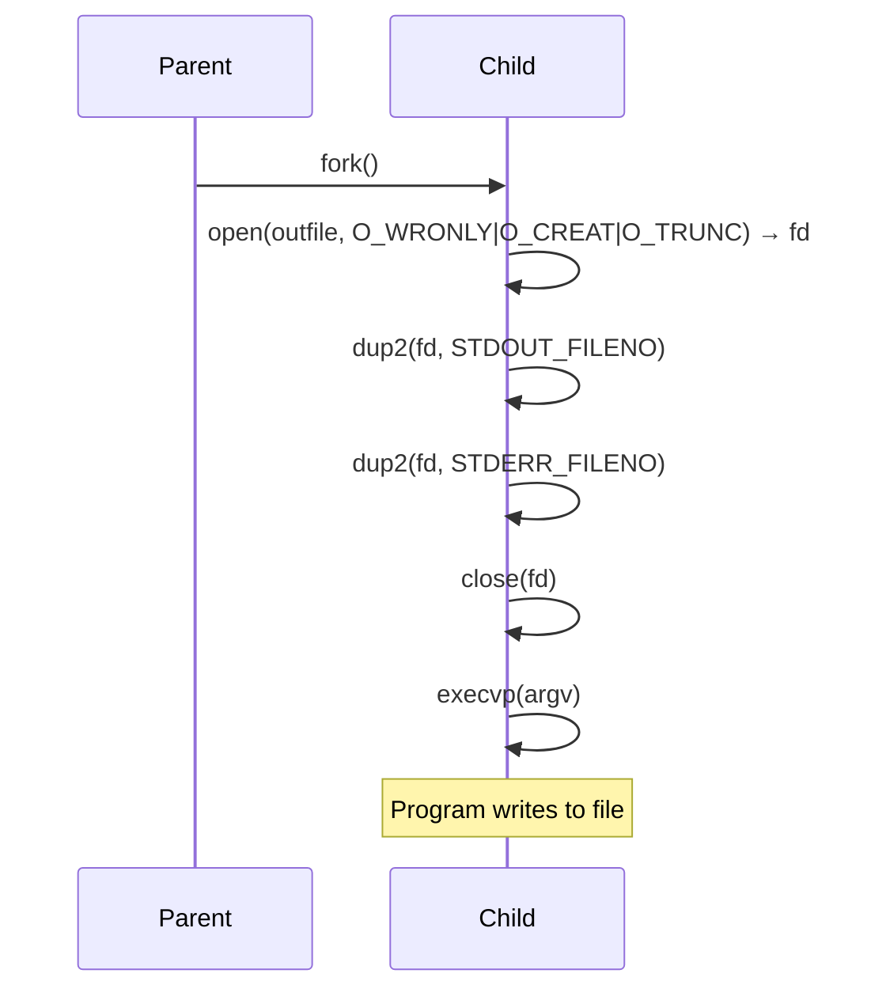

# DESIGN_DOC5: Output Redirection (> outfile) and Combined (< >)

## Quick Index
1. What this feature provides
2. Parsing and token removal
3. Child setup (open + dup2 for output)
4. Combined redirection (< and >)
5. Error handling
6. Examples to try
7. Limits and future work

## 1) What this feature provides
- Redirects a program's stdout (and stderr) to a file.
- Syntax: `cmd > outfile.txt`.
- Combined: `cmd < infile.txt > outfile.txt`.

### File/Function Access Map
```mermaid
graph TD
    A[Output Redirection] --> B[myterm/shell.c]
    
    B --> B1[parse_redirections: extract > outfile]
    B --> B2[execute_simple: child setup]
    B --> B3[open: O_WRONLY|O_CREAT|O_TRUNC]
    B --> B4[dup2: stdout/stderr redirect]
```

## 2) Parsing and token removal
Handler: `myterm/shell.c: parse_redirections()`.

- Scans `argv[]` for `>` token followed by a filename.
- Removes both tokens from `argv[]` via `strip_pair()`.
- Stores the filename in `outfile` pointer.

References:
- `myterm/shell.c: parse_redirections()` lines 9–25.

## 3) Child setup (open + dup2 for output)
In `myterm/shell.c: execute_simple()`, after `fork()`:

- Child opens the file: `fd = open(outfile, O_WRONLY | O_CREAT | O_TRUNC, 0644)`.
- If open fails, print error and exit with code 126.
- `dup2(fd, STDOUT_FILENO)` and `dup2(fd, STDERR_FILENO)` redirect both streams.
- Close the original `fd`.
- Proceed to `execvp()`.

### Output Redirection Diagram


References:
- `myterm/shell.c: execute_simple()` line 36.

## 4) Combined redirection (< and >)
- Both `<` and `>` are parsed and removed.
- In child, apply input redirection first, then output redirection.
- Example: `cat < in.txt > out.txt` reads from `in.txt` and writes to `out.txt`.

References:
- `myterm/shell.c: execute_simple()` lines 35–36 (combined redirection setup).

## 5) Error handling
- File creation/permission error: child prints error via `perror("open outfile")` and exits with 126.
- `dup2()` failure: child prints error and exits with 126.

References:
- `myterm/shell.c: execute_simple()` lines 35–40 (error handling for redirections).

## 6) Examples to try
- `echo hi > o.txt` then `cat o.txt` → shows "hi".
- `cat < in.txt > out.txt` → copies `in.txt` to `out.txt`.
- `ls -l > list.txt` → saves directory listing to file.

## 7) Limits and future work
- Requires spaces: `cmd > file` (not `cmd>file`).
- No append mode `>>` yet.
- No separate stderr redirection (`2>`, `2>&1`) yet.
- Future: support `>>`, `2>`, and `2>&1` syntax.
