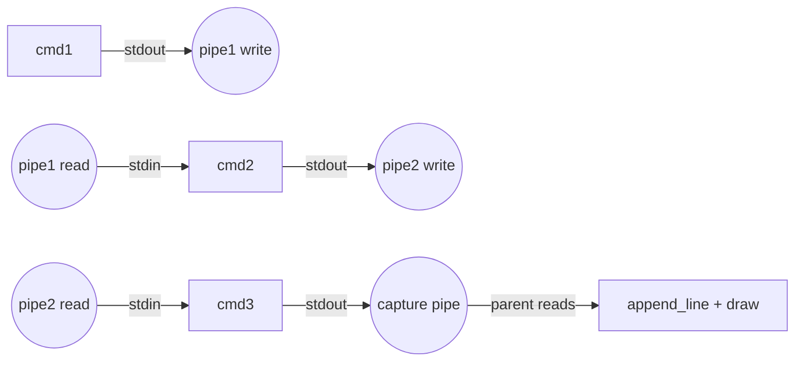

# DESIGN_DOC6: Pipes (cmd1 | cmd2 | ...)

## Quick Index
1. What this feature provides
2. Splitting and pipe creation
3. Forking and wiring (dup2 per stage)
4. Process group and signal handling
5. Foreground capture (last stage)
6. Deadlock prevention (close unused ends)
7. Examples to try
8. Limits and future work

## 1) What this feature provides
- Connects stdout of one command to stdin of the next.
- Syntax: `cmd1 | cmd2 | cmd3`.
- Data flows left to right; last stage output is captured and displayed in GUI (foreground) or tracked as a job (background).

### File/Function Access Map
```mermaid
graph TD
    A[Pipes] --> B[myterm/shell.c]
    
    B --> B1[split_pipeline: tokenize by |]
    B --> B2[execute_pipeline: N-stage setup]
    B --> B3[pipe: create N-1 pipes]
    B --> B4[fork: N children]
    B --> B5[dup2: wire stdin/stdout]
    B --> B6[setpgid: process group]
```

## 2) Splitting and pipe creation
Handler: `myterm/shell.c: execute_pipeline()`.

- `split_pipeline()` splits the command line by `|` into stages.
- For N stages, create N−1 pipes using `pipe()`.

References:
- `myterm/shell.c: split_pipeline()` lines 111–113.
- `myterm/shell.c: execute_pipeline()` lines 141–230.

## 3) Forking and wiring (dup2 per stage)
For each stage i (0 to N−1):
- `fork()` a child.
- In child:
  - If not first stage (i > 0): `dup2(pipes[i-1][0], STDIN_FILENO)`.
  - If not last stage (i < N−1): `dup2(pipes[i][1], STDOUT_FILENO)` and `dup2(pipes[i][1], STDERR_FILENO)`.
  - If last stage and foreground: `dup2(capture_pipe[1], STDOUT_FILENO)` and `dup2(capture_pipe[1], STDERR_FILENO)`.
  - Close all pipe FDs (both read and write ends for all N−1 pipes, plus capture pipe if present).
  - `execvp(argv)`.

### Pipeline Wiring Diagram


References:
- `myterm/shell.c: execute_pipeline()` lines 156–178.

## 4) Process group and signal handling
- All children join the same process group (PGID = first child PID).
- Parent sets `current_fg_pgid = pgid` for foreground pipelines.
- Ctrl+C sends `SIGINT` to `-pgid`; Ctrl+Z sends `SIGTSTP` to `-pgid`.

References:
- `myterm/shell.c: execute_pipeline()` lines 160, 173, 191, 202–212.

## 5) Foreground capture (last stage)
- A capture pipe is created for foreground pipelines.
- Last stage's stdout/stderr are redirected to the capture pipe.
- Parent reads from capture pipe in non-blocking mode, appending lines and pumping X events.
- After EOF, parent waits for all children with `waitpid()`.

References:
- `myterm/shell.c: execute_pipeline()` lines 152–154, 164, 190–229.

## 6) Deadlock prevention (close unused ends)
- Critical: all unused pipe ends must be closed in both parent and children.
- Parent closes write ends after forking each stage and read ends after the stage that consumes them.
- Children close all pipe FDs before `execvp()`.
- This ensures EOF propagates correctly and no process hangs waiting for input.

References:
- `myterm/shell.c: execute_pipeline()` lines 166–167, 176–177, 181.

## 7) Examples to try
- `ls *.c | wc -l` → counts C files.
- `cat README.md | sort | head -n 3` → sorted top 3 lines.
- `echo hello | tr a-z A-Z` → uppercase conversion.

## 8) Limits and future work
- Only last stage output is captured for display; intermediate stderr may mix.
- No separate stderr capture per stage yet.
- Future: capture intermediate stderr; add progress diagnostics for long pipelines.
