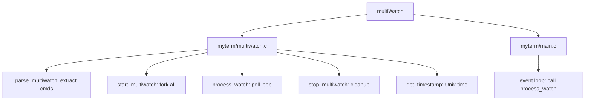
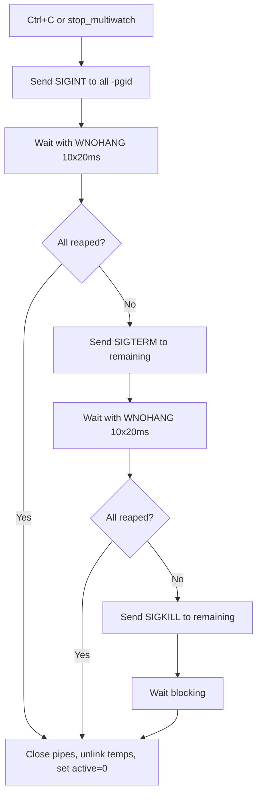

# DESIGN_DOC7: New Command multiWatch

## Quick Index
1. What this feature provides
2. Parsing the command list
3. Forking and PGID setup
4. Poll loop and non-blocking reads
5. Temp files and output formatting
6. Ctrl+C cleanup (escalating signals)
7. Examples to try
8. Limits and future work

## 1) What this feature provides
- Runs multiple commands in parallel.
- Displays their outputs as they arrive, labeled with command name and Unix timestamp.
- Syntax: `multiWatch ["cmd1", "cmd2", ...]`.

### File/Function Access Map


## 2) Parsing the command list
Handler: `myterm/multiwatch.c: parse_multiwatch()`.

- Extracts commands from the bracket-quoted list.
- Handles both `"cmd"` and bare tokens separated by commas.
- Stores up to `MAX_WATCH_CMDS` commands.

References:
- `myterm/multiwatch.c: parse_multiwatch()` lines 12–40.

## 3) Forking and PGID setup
Handler: `myterm/multiwatch.c: start_multiwatch()`.

- For each command:
  - Create a pipe.
  - `fork()` a child.
  - Child: `setpgid(0,0)` to become its own process group leader; redirect stdout/stderr to pipe write end; `execl("/bin/sh", "sh", "-c", cmd)`.
  - Parent: `setpgid(pid, pid)` to confirm PGID; close write end; open a temp file `.temp.<pid>.txt` for logging.

References:
- `myterm/multiwatch.c: start_multiwatch()` lines 87–118.

## 4) Poll loop and non-blocking reads
Handler: `myterm/multiwatch.c: process_watch()`.

- Called from the main event loop (`myterm/main.c`).
- Uses `poll()` with timeout 0 (non-blocking) to check all pipe read ends.
- For each ready pipe:
  - Read data into a buffer.
  - Write to the corresponding temp file.
  - Accumulate lines; on newline, format and append a labeled block with timestamp.

References:
- `myterm/multiwatch.c: process_watch()` lines 120–190 (includes auto-stop detection)
- `myterm/main.c` line 122 (call to process_watch in event loop).

## 5) Temp files and output formatting
- Each command's output is logged to `.temp.<pid>.txt`.
- When a full line is detected, a block is printed:
  ```
  "cmd" , <timestamp> :
  ----------------------------------------------------
  <output line>
  ----------------------------------------------------
  ```
- Timestamp format: Unix epoch with milliseconds (e.g., `1698173311.123`).

References:
- `myterm/multiwatch.c: get_timestamp()` lines 3–10.
- `myterm/multiwatch.c: process_watch()` lines 150–157 (output formatting).

## 6) Ctrl+C cleanup (escalating signals)
Handler: `myterm/multiwatch.c: stop_multiwatch()`.

- Phase 1: Send `SIGINT` to each child's PGID (`-pid`); wait with `WNOHANG` for 10 attempts (20ms each).
- Phase 2: Send `SIGTERM` to remaining children; wait again.
- Phase 3: Send `SIGKILL` to force termination; wait blocking.
- Close all pipes and temp file descriptors; `unlink()` temp files; set `t->watch.active = 0`.

References:
- `myterm/multiwatch.c: stop_multiwatch()` lines 42–85.
- `myterm/main.c` lines 75–79 (Ctrl+C detection for multiWatch).

## 7) Ctrl+Z support (move to background)
Handler: `myterm/main.c` event loop.

- When Ctrl+Z is pressed during multiWatch:
  - Send `SIGTSTP` to each child process group.
  - Send `SIGCONT` to resume them in background.
  - Add each process to the job list (`Tab.procs[]`).
  - Close pipes and temp files (cleanup without killing).
  - Set `t->watch.active = 0` to mark multiWatch as inactive.
  - Display `[multiWatch moved to background]`.

References:
- `myterm/main.c` lines 92–123 (Ctrl+Z detection and background handling).

### Cleanup Flow Diagram


## 8) Examples to try
- `multiWatch ["ls -l", "sleep 2", "echo hi"]` → observe interleaved output with labels.
- `multiWatch ["date", "uptime", "whoami"]` → quick commands with timestamps.
- Press Ctrl+C to stop multiWatch mid-run.
- Press Ctrl+Z to move multiWatch to background → check with `jobs`.

## 9) Limits and future work
- Large bursts may batch; per-command stderr is unified with stdout.
- No per-stream coloring yet.
- Future: configurable refresh rate; filter patterns; separate stderr capture.
