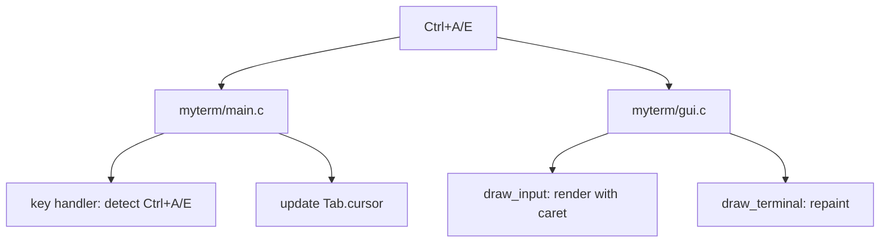

# DESIGN_DOC8: Line Navigation (Ctrl+A, Ctrl+E)

## Quick Index
1. What this feature provides
2. Key handling and cursor update
3. Repaint and visual alignment
4. Examples to try
5. Limits and future work

## 1) What this feature provides
- Familiar Bash-like shortcuts for quick cursor movement.
- Ctrl+A jumps to the start of the input line.
- Ctrl+E jumps to the end of the input line.

### File/Function Access Map

## 2) Key handling and cursor update
Handler: `myterm/main.c` KeyPress event.

- When `(event.xkey.state & ControlMask)` and `keysym == XK_a`: set `Tab.cursor = 0`.
- When `(event.xkey.state & ControlMask)` and `keysym == XK_e`: set `Tab.cursor = strlen(Tab.input_line)`.
- Trigger `draw_terminal()` to repaint.

References:
- `myterm/main.c` lines 131–132.

## 3) Repaint and visual alignment
- `myterm/gui.c: draw_input()` renders the prompt + input as a single Pango layout.
- Caret position is derived from `len(prefix) + cursor`.
- Pango provides the exact pixel rectangle for the caret, keeping it visually aligned even with multi-byte Unicode.

References:
- `myterm/gui.c: draw_input()` lines 180–220 (Pango layout and caret rendering).
- `myterm/gui.c: draw_terminal()` lines 30–150 (full repaint trigger).

## 4) Examples to try
- Type a long line with Unicode: `echo नमस्ते world`.
- Press Ctrl+A → caret jumps to start.
- Press Ctrl+E → caret jumps to end.
- Verify caret stays aligned with glyphs.

## 5) Limits and future work
- Cursor is byte-based; no grapheme-cluster navigation yet.
- No word-wise jumps (Ctrl+Left/Right) yet.
- Future: add Ctrl+Left/Right for word boundaries; grapheme-aware movement.
