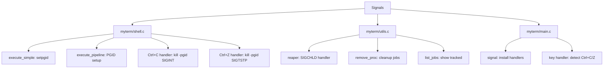

# DESIGN_DOC9: Interrupting/Backgrounding (Signals)

## Quick Index
1. What this feature provides
2. Process groups (PGID)
3. Ctrl+C (SIGINT)
4. Ctrl+Z (SIGTSTP) and job tracking
5. Job control builtins (jobs, bg, fg, kill)
6. Zombie prevention (reaper)
7. Examples to try
8. Limits and future work

## 1) What this feature provides
- Interrupt foreground jobs with Ctrl+C.
- Stop and background jobs with Ctrl+Z.
- Manage jobs with `jobs`, `bg <pid>`, `fg <pid>`, `kill <pid>`.

### File/Function Access Map

## 2) Process groups (PGID)
- Each child (or pipeline) is placed in its own process group via `setpgid(0,0)` in child and `setpgid(pid, pid)` in parent.
- Signals are sent to the entire group using negative PGID: `kill(-pgid, SIGINT)`.
- This ensures all processes in a pipeline or job receive the signal.

References:
- `myterm/shell.c: execute_simple()` line 33.
- `myterm/shell.c: execute_pipeline()` lines 160, 173.

## 3) Ctrl+C (SIGINT)
- During foreground execution, the parent reads output in a loop and pumps X events.
- When Ctrl+C is detected (KeySym + ControlMask), `kill(-current_fg_pgid, SIGINT)` is called.
- The foreground job is interrupted; parent continues reading until EOF or child exit.

References:
- `myterm/shell.c: execute_simple()` lines 54–60 (Ctrl+C with immediate break).
- `myterm/shell.c: execute_pipeline()` lines 203–209 (Ctrl+C with immediate break).
- `myterm/main.c` lines 74–90 (Ctrl+C key detection in event loop with idle state handling).

## 4) Ctrl+Z (SIGTSTP) and job tracking
- When Ctrl+Z is detected, `kill(-current_fg_pgid, SIGTSTP)` is sent to stop the process.
- The job is recorded in `Tab.procs[]` with its PID and command.
- `kill(-current_fg_pgid, SIGCONT)` is sent immediately to resume it in background.
- The process continues running in background and will auto-remove from jobs when complete.
- A message `[moved to background]` is printed.

References:
- `myterm/shell.c: execute_simple()` lines 61–67 (Ctrl+Z during command execution).
- `myterm/shell.c: execute_pipeline()` lines 210–216 (Ctrl+Z during pipeline).
- `myterm/main.c` lines 119–134 (Ctrl+Z in main event loop for foreground processes).

## 5) Job control builtins (jobs, bg, fg, kill)
- `jobs`: lists tracked background processes for the current tab.
  - Actively checks if processes are still alive using `waitpid(-pid, &status, WNOHANG)`.
  - Automatically removes dead processes from the job list.
  - Falls back to `kill(-pid, 0)` check if waitpid doesn't catch it.
- `bg <pid>`: sends `SIGCONT` to a stopped job to resume it in background.
- `fg <pid>`: brings a background job to foreground and waits for it (with event pumping).
- `kill <pid>`: sends `SIGTERM` to a process and removes it from the job list.

References:
- `myterm/shell.c: run_command()` lines 314–331.
- `myterm/utils.c: list_jobs()` lines 87–116 (with active cleanup).
- `myterm/utils.c: remove_proc()` lines 83–85.

## 6) Zombie prevention and auto-cleanup (reaper)
- A `SIGCHLD` handler (`myterm/utils.c: reaper()`) is installed at startup.
- It calls `waitpid(-1, &status, WNOHANG)` in a loop to reap finished children.
- Reaped PIDs are automatically removed from all tabs' job lists.
- Additionally, the `jobs` command actively checks and reaps dead processes:
  - Uses `waitpid(-pid, &status, WNOHANG)` to check process groups.
  - Checks for `ECHILD` error (no children = process gone).
  - Falls back to `kill(-pid, 0)` for existence check.
- This dual approach ensures backgrounded processes are always cleaned up.

References:
- `myterm/main.c` line 6 (signal handler installation).
- `myterm/utils.c: reaper()` lines 118–120 (SIGCHLD handler).
- `myterm/utils.c: list_jobs()` lines 87–116 (active cleanup in jobs command).

## 7) Examples to try
- `sleep 10` then press Ctrl+C → job interrupted immediately.
- `sleep 30` then press Ctrl+Z → job moved to background, continues running.
- `jobs` → lists background jobs (will show the sleep process).
- Wait 30 seconds, then `jobs` again → sleep process auto-removed after completion.
- `bg <pid>` → resumes a stopped job in background.
- `fg <pid>` → brings a background job to foreground.
- `kill <pid>` → terminates a job.

## 8) Limits and future work
- No full TTY discipline; some programs expect a real terminal.
- No job control for programs that ignore SIGINT/SIGTSTP.
- Future: pseudo-terminal (PTY) for richer job control and TTY emulation.
